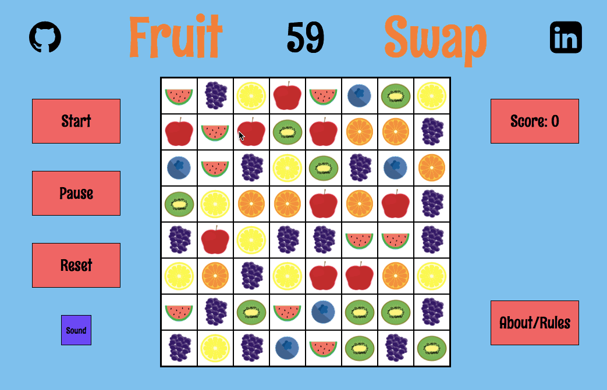

# Fruitswap

Fruitswap is a match-3 game inspired by Bejeweled. The goal of this
game is to score as many points as possible in 60 seconds. The player
is able to swap fruit by clicking and dragging a fruit to the place
where they want to swap to. If the swap causes 3 or more of the same
fruit to line up, the matched fruit disappears and the empty space is
filled in by cascading down the fruit above it.

